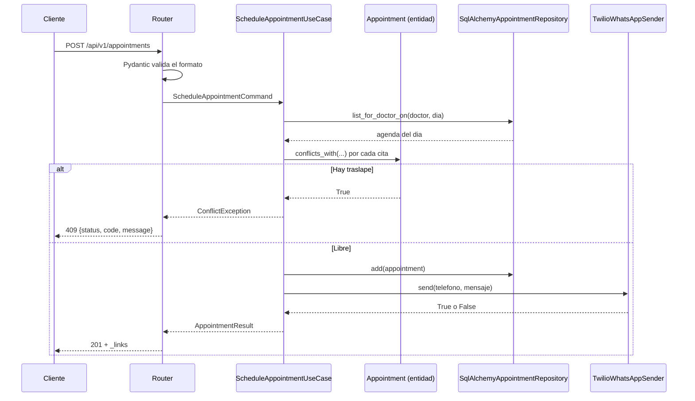

# C4 Nivel 3 — Componentes del contenedor API

La API implementa la **arquitectura en capas** que define la guia AIVARA. La regla
es una sola: **las capas superiores dependen de las inferiores, nunca al reves.**

```
┌────────────────────────────────────────────────────────────┐
│ PRESENTACION            src/app/presentation/              │
│ routers · schemas Pydantic · errores HTTP · dependencies   │
└───────────────────────────┬────────────────────────────────┘
                            │ comandos y DTOs
┌───────────────────────────▼────────────────────────────────┐
│ APLICACION              src/app/application/               │
│ casos de uso · DTOs · redaccion de mensajes                │
└───────────────────────────┬────────────────────────────────┘
                            │ entidades y puertos
┌───────────────────────────▼────────────────────────────────┐
│ DOMINIO                 src/app/domain/         ← sin E/S  │
│ entidades · value objects · excepciones · PUERTOS (ABC)    │
└───────────────────────────▲────────────────────────────────┘
                            │ implementa los puertos
┌───────────────────────────┴────────────────────────────────┐
│ INFRAESTRUCTURA         src/app/infrastructure/            │
│ SQLAlchemy · Twilio · reloj · configuracion · OTel         │
└────────────────────────────────────────────────────────────┘
```

Observe que la flecha de infraestructura apunta **hacia arriba**: es la
**inversion de dependencias** (la D de SOLID). El dominio declara qué necesita
(`AppointmentRepository`, `NotificationSender`, `Clock`) y la infraestructura se
adapta. Por eso `domain/` no importa SQLAlchemy, httpx ni FastAPI.

## Componentes por capa

### Dominio (`src/app/domain/`)

| Componente | Responsabilidad |
|---|---|
| `entities/appointment.py` | Entidad `Appointment`: transiciones de estado, regla de conflicto |
| `entities/person.py` | `Patient` y `Doctor` |
| `value_objects/time_slot.py` | Franja `[inicio, fin)` y regla de solapamiento |
| `value_objects/phone_number.py` | Normalizacion E.164 |
| `value_objects/medical_license.py` | Formato de cedula profesional |
| `exceptions.py` | `BusinessException` y descendientes |
| `ports/` | Interfaces `AppointmentRepository`, `NotificationSender`, `Clock` |

### Aplicacion (`src/app/application/`)

| Caso de uso | Que orquesta |
|---|---|
| `ScheduleAppointmentUseCase` | Validar → verificar agenda → persistir → notificar |
| `RescheduleAppointmentUseCase` | Cambio parcial; notifica **solo** si afecta al paciente |
| `ChangeAppointmentStatusUseCase` | Confirmar, atender, cancelar |
| `QueryAppointmentsUseCase` | Lecturas con resolucion de nombres en lote (evita N+1) |
| `DeleteAppointmentUseCase` | Borrado administrativo |
| `SendAppointmentRemindersUseCase` | Recordatorios de las citas de manana |

### Infraestructura (`src/app/infrastructure/`)

| Componente | Puerto que implementa |
|---|---|
| `SqlAlchemyAppointmentRepository` | `AppointmentRepository` |
| `TwilioWhatsAppSender` | `NotificationSender` |
| `LoggingNotificationSender` | `NotificationSender` (por defecto en local) |
| `SystemClock` | `Clock` |
| `mappers.py` | Traduccion fila ↔ entidad |

### Presentacion (`src/app/presentation/`)

| Componente | Responsabilidad |
|---|---|
| `api/v1/routers/` | Endpoints REST |
| `api/v1/schemas/` | Contrato de entrada y salida; alimenta OpenAPI |
| `api/errors.py` | Traduce `BusinessException` → codigo HTTP |
| `dependencies.py` | Composition root: une interfaces con implementaciones |

## Flujo de una peticion



Note que la verificacion de conflicto **no** es una consulta `EXISTS` en SQL: el
repositorio devuelve entidades y la regla se evalua en el dominio. Es mas costoso
en teoria —una agenda diaria son decenas de filas, no millones— y a cambio la
regla queda cubierta por pruebas unitarias sin base de datos.
