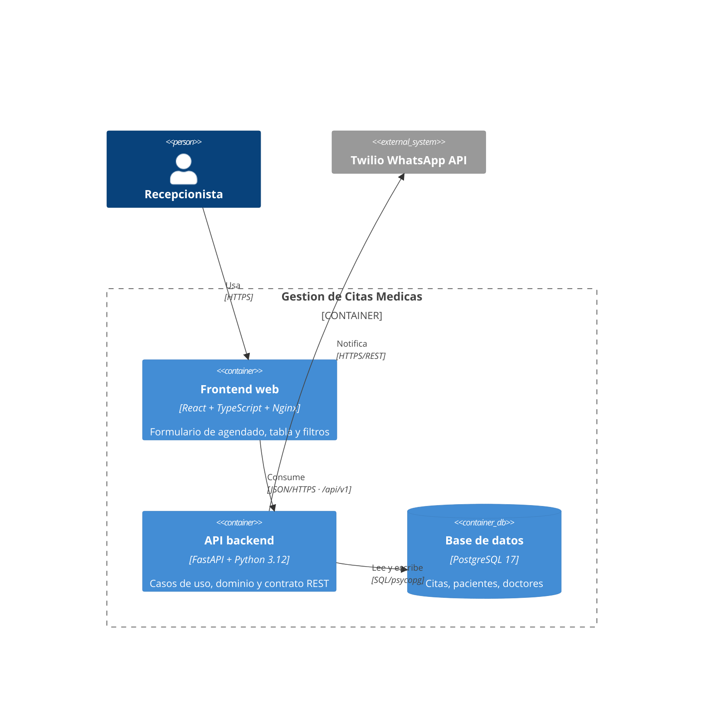

# C4 Nivel 2 — Contenedores

| Contenedor | Tecnologia | Responsabilidad | Puerto |
|---|---|---|---|
| **Frontend web** | React 19 + TypeScript + Vite, servido por Nginx | Interfaz de la recepcion; consume la API REST | 8080 |
| **API backend** | Python 3.12 + FastAPI + Uvicorn | Reglas de negocio y contrato REST versionado | 8000 |
| **Base de datos** | PostgreSQL 17 | Persistencia de citas, pacientes y doctores | 5432 |
| **Colector OTel** | OpenTelemetry Collector | Recepcion y reenvio de telemetria | 4317 |

## Diagrama

## Decisiones de despliegue

- Nginx sirve el frontend **y** hace proxy de `/api/` hacia el backend, de modo que
  ambos comparten origen y CORS deja de ser un problema en produccion.
- En desarrollo, el proxy de Vite cumple el mismo papel (`VITE_API_TARGET`).
- El backend expone `/health` para las sondas de Docker y del balanceador.
