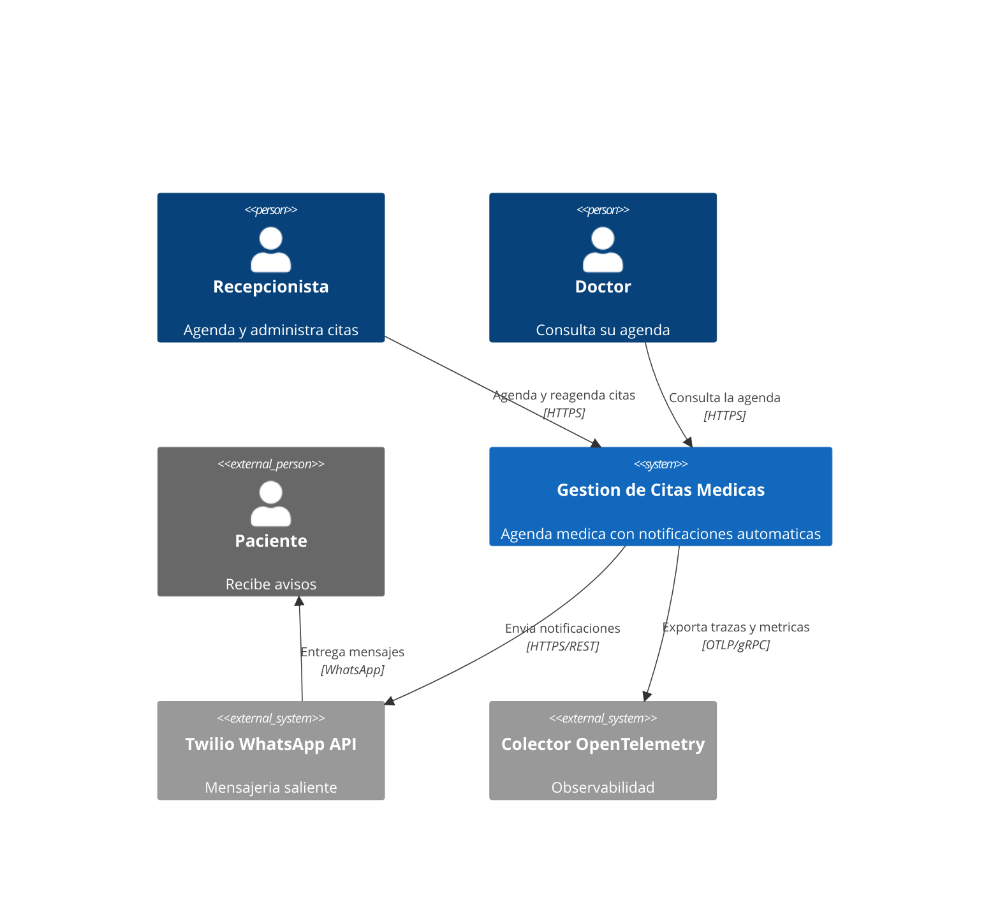

# C4 Nivel 1 — Contexto

## Sistema

**Sistema de Gestion de Citas Medicas**: permite a una clinica agendar, reagendar,
confirmar, atender y cancelar citas, notificando al paciente en cada cambio que le
afecta.

## Actores

| Actor | Descripcion | Interaccion |
|---|---|---|
| **Recepcionista** | Personal administrativo de la clinica | Agenda, reagenda y cancela citas desde la interfaz web |
| **Doctor** | Medico que atiende | Consulta su agenda y marca las citas como atendidas |
| **Paciente** | Persona que recibe atencion | No usa el sistema; recibe notificaciones por WhatsApp |

## Sistemas externos

| Sistema | Proposito | Modo de acoplamiento |
|---|---|---|
| **Twilio WhatsApp API** | Entrega de confirmaciones, avisos de cambio y recordatorios | Detras del puerto `NotificationSender`; sustituible sin tocar el dominio |
| **Colector OpenTelemetry** | Recepcion de trazas y metricas | Opcional, activable con `OTEL_ENABLED` |

## Diagrama

## Restricciones

- El paciente no tiene acceso directo al sistema; toda comunicacion es saliente.
- Una notificacion fallida **nunca** revierte una operacion de negocio ya confirmada.
- Un paciente sin telefono registrado es un caso valido, no un error.
